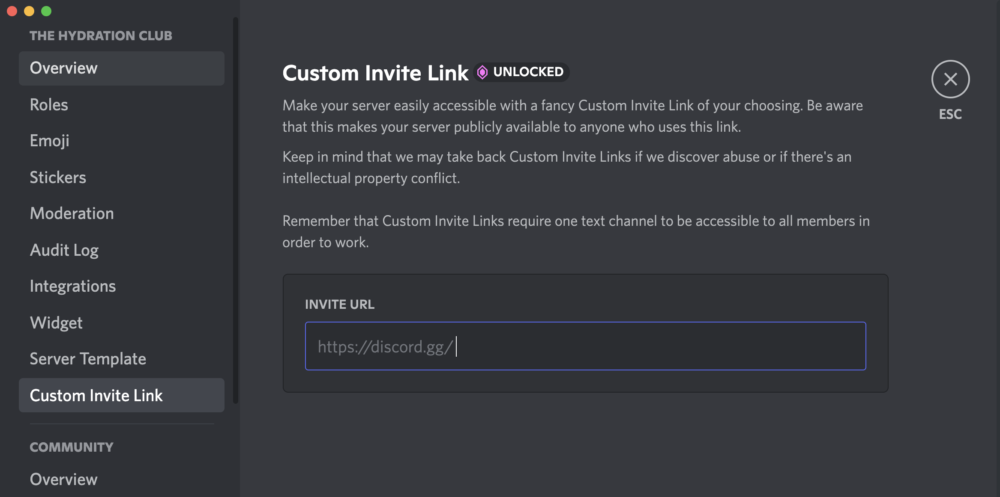
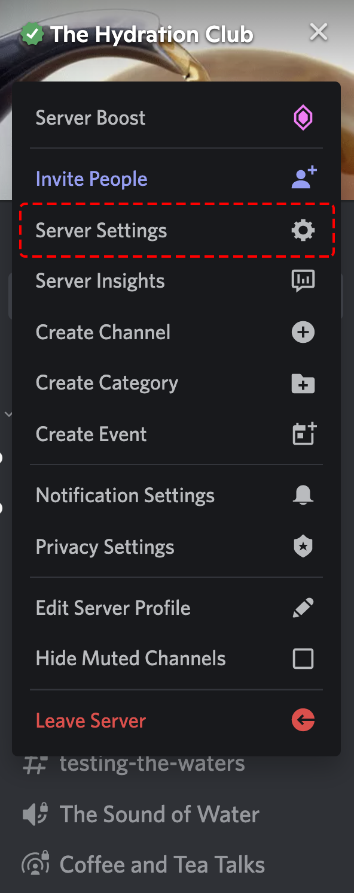
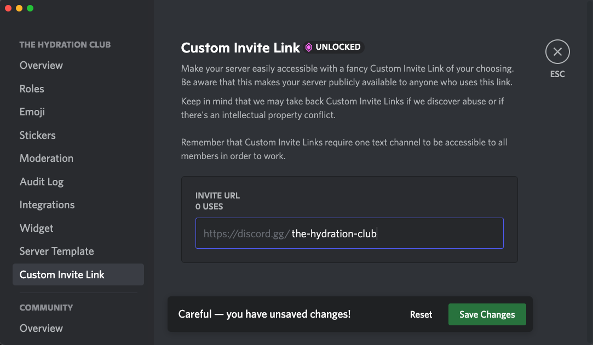

# Створення спеціального посилання для запрошення
  У Діскорді є можливість призначити вашому серверу запрошення за спеціальною URL-адресою, якщо сервер досягне 3 рівня бустів (для 3 рівня потрібно 14 бустів).
  
  

Ви можете ввести будь-які слова, фрази чи цифри, щоб створити унікальне посилання лише на ваш сервер.
<h2 style="text-align: center;">Важлива інформація</h4>
- Будь-хто може скористатися цим посиланням, щоб приєднатися до вашого сервера.
- Спеціальне посилання для запрошення вимагає, щоб ваш сервер мав принаймні один текстовий канал із увімкненим дозволом на читання повідомлень для ролі @everyone.
- Модерація Discord може видалити або відновити спеціальні посилання для запрошення, якщо виявить порушення або якщо виникне конфлікт інтелектуальної власності.

<h2 style="text-align: center;">Як призначити спеціальне посилання для запрошення</h4>
**Крок 1**. Переконайтеся, що у вас є текстовий канал із увімкненим дозволом на перегляд каналу для ролі @everyone.

**Крок 2**. Перейдіть на вкладку Спеціальне посилання для запрошення, щоб налаштувати унікальне посилання!

  

  

**А тепер ви готові поділитися своїм спеціальним посиланням для запрошення з усіма іншими!**

